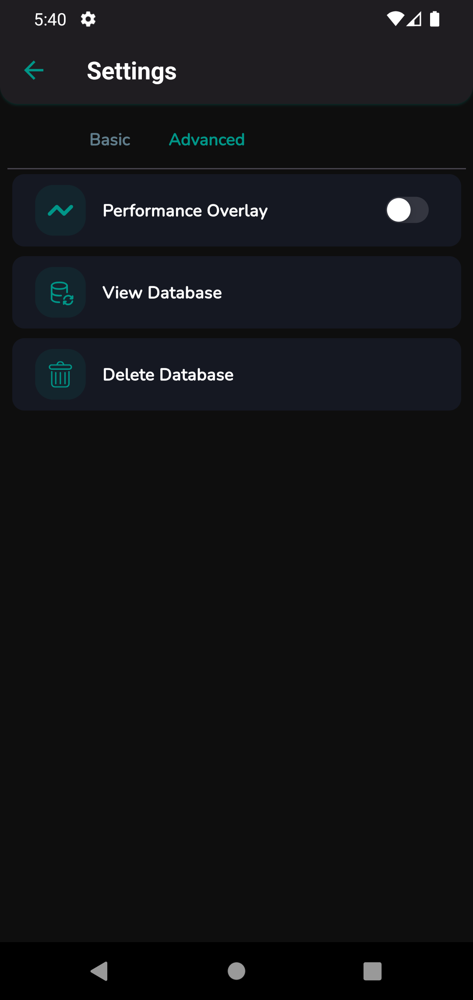

# Kawaii Advanced Technology & Solution Ltd.
## Flutter & Firebase Developer Recruitment Assessment

Developing a chat application using Flutter and Firebase. The application have the following features:

- Chat functionality
- Notifications
- Login and Logout features

Packages:

- flutter_riverpod
- flutter_hooks
- go_router

Extra Features:

- Show the network status.
- Show the loading indicator while fetching data from the Firebase.
- Api error handling.
- Show the error message if the API fails to fetch data.
- Dark and light theme support.
- Change the language (English and Bengali).
- Change the Date and Time format.
- Change font style.
- View the local database data.
- Clear the local database data.
- Show the app performance graph.


```Note: Flutter push notification (FCM) is only available in real mobile devices.```

## Live Preview 

[Preview Website](https://kawaiibd-chitchat.web.app/) Click on the link to see the live preview of the application in multiple devices.

[Download APK](https://github.com/sabikrahat/kawaiibd_chitchat/releases) Click on the latest release and download the APK file.


## UI Design

<table>
  <tr>
    <td></td>
    <td></td>
    <td></td>
  </tr>
  <tr>
    <td></td>
    <td></td>
    <td></td>
  </tr>
  <tr>
    <td></td>
    <td></td>
    <td></td>
  </tr>
    <tr>
        <td></td>
        <td></td>
        <td></td>
    </tr>
    <tr>
        <td></td>
        <td></td>
    </tr>
 </table>

# If you have any questions, feel free to ask me.